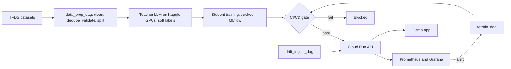

# Distillate: Distilled Real-Time Content Moderation

> **Content warning:** the datasets in this project contain slurs, threats, and hateful language. Examples in this repo and its dashboards are masked.

Distillate trains a small toxicity classifier that runs on CPU by distilling knowledge from a 4B-parameter open LLM. The student learns from human labels plus the teacher's per-label probabilities. Around the model is a full MLOps pipeline: versioned data, tracked experiments, a CI/CD evaluation gate, Cloud Run serving, monitoring with drift detection, and automated retraining.

**Course:** IE7374 Machine Learning Operations, Northeastern University (Prof. Ramin Mohammadi)

---

## How it works



| Component | Choice |
|---|---|
| Teacher (not final) | Leading option: Qwen3-4B-Instruct-2507, zero-shot, with a LoRA fine-tuned classifier as a fallback. Alternatives under evaluation: Kev-4B (open decision model that returns calibrated probabilities per question), Qwen3Guard-Gen-4B, Qwen3.5-4B, Gemma 4 E4B |
| Student (not final) | Leading option: DistilBERT. Also comparing MiniLM-L12 (smaller) and ModernBERT-base (larger); the served model is chosen from pilot results |
| Serving | FastAPI + ONNX Runtime (int8) on Cloud Run, CPU only |
| Pipelines | Airflow, DVC (GCS remote), MLflow |
| Monitoring | Prometheus, Grafana, Evidently, labeled canary set |
| Demo | Streamlit app: try-it page, moderation queue, status page |

## Data

| Dataset | Role | Version | License |
|---|---|---|---|
| [`wikipedia_toxicity_subtypes`](https://www.tensorflow.org/datasets/catalog/wikipedia_toxicity_subtypes) | Training, validation, gate set | 0.3.1 | CC0 (per TFDS) |
| [`civil_comments`](https://www.tensorflow.org/datasets/catalog/civil_comments) | Shifted-domain test, drift stream, bias evaluation | 1.2.4 | CC0 (per TFDS) |

Raw text lives in a private GCS bucket and is pulled with DVC; Git holds only pointer files. Please cite Wulczyn, Thain, and Dixon (2017), "Ex Machina: Personal Attacks Seen at Scale", and Borkan et al. (2019), "Nuanced Metrics for Measuring Unintended Bias with Real Data for Text Classification".

## Repository layout

```text
.github/workflows/   CI/CD: tests, data checks, gate, build, deploy, rollback
dags/                Airflow: data_prep_dag, drift_ingest_dag, retrain_dag
docker/              Images for ingestion, serving, and the demo app
frontend/            Streamlit demo app
kaggle/              Teacher labeling and student training notebooks
src/                 data, teacher, student, analysis, eval, serving
monitoring/          Alert rules, canary replay, drift checks, dashboards
deploy/              Cloud Run service definition and GCP setup script
docs/                Model card, data card, risk log, cost assumptions
tests/               Unit tests (pytest)
```

## Installation

**Prerequisites:** Python 3.12, Docker, the `gcloud` CLI, and read access to the team's GCS bucket.

```bash
git clone https://github.com/Nishaant-Soni/Distillate.git
cd distillate
python -m venv .venv && source .venv/bin/activate
pip install -r requirements.txt
cp .env.example .env        # set GCP project, bucket, and MLflow tracking URI
gcloud auth application-default login
dvc pull                    # fetch versioned data and split manifests
docker compose up -d        # local API, Prometheus, Grafana, Airflow
```

Local services: API at `localhost:8000`, Airflow at `localhost:8080`, Grafana at `localhost:3000`.

## Usage

**1. Prepare data.** Trigger `data_prep_dag` from the Airflow UI, or:
```bash
docker compose exec airflow-scheduler airflow dags trigger data_prep_dag
```

**2. Generate teacher labels.** Open `kaggle/label_shards.ipynb` on Kaggle (T4 x2), add the GCS credential in Kaggle Secrets, and use "Save & Run All". The job writes shards to GCS and resumes where it left off if a session ends. `data_prep_dag` validates and merges the shards.

**3. Train a student.**
```bash
python -m src.student.distill --config params.yaml    # runs are logged to MLflow
```

**4. Run the evaluation gate locally.**
```bash
python -m src.eval.gate --model models/student.onnx   # exits non-zero if the gate fails
```

**5. Query the API.**
```bash
curl -X POST localhost:8000/predict \
  -H "Content-Type: application/json" \
  -d '{"text": "thanks for the helpful edit"}'
```
The response holds a score per label, the decision at the tuned thresholds, latency, and the model version.

**6. Start the demo app.**
```bash
streamlit run frontend/app.py
```

**7. Deploy.** Run `bash deploy/setup_gcp.sh` once per GCP project. After that, every merge to `main` runs CI, and a candidate that passes the gate is deployed to Cloud Run as a new revision.

## Operations

- **Monitoring:** Grafana shows latency, throughput, flagged rate per label, canary accuracy, delayed-label accuracy per drift batch, and drift scores.
- **Retraining:** an alert on accuracy or drift triggers `retrain_dag`. The new model reaches traffic only if it passes the same gate.
- **Rollback:** shift traffic back to the previous revision and point the MLflow `production` alias at the previous model version:
  ```bash
  gcloud run services update-traffic distillate-api --to-revisions=<previous-revision>=100 --region=<region>
  ```
- **Reproducibility:** data and splits are versioned with DVC; every teacher run records its prompt hash, model revision, and package versions; every training run is in MLflow.

## Privacy

The API does not log request text; monitoring stores only a text hash, its length, and the scores. Text typed into the demo app is discarded unless the visitor opts in.

## Team

Vaishnavi Hemal Jariwala, Nishaant Sitendra Soni, Ruchita Yogesh Patil, Praniti Sunil Kale, Shivam Singh, Sai Venkata Kashyap Akula

## License

Code: see `LICENSE`. Datasets keep their own licenses (above). Trained model weights are not published outside the course without instructor approval.
